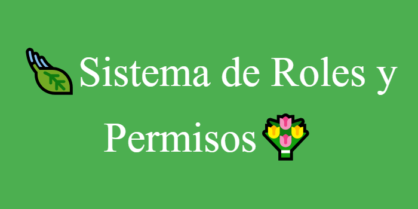
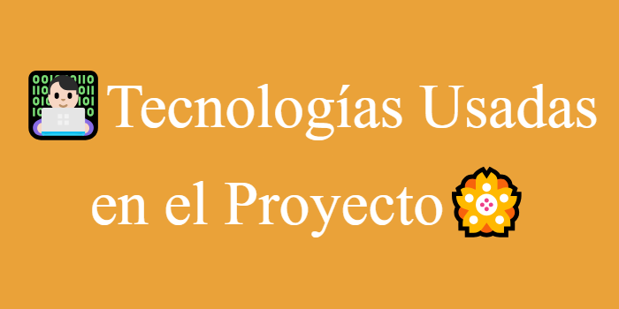
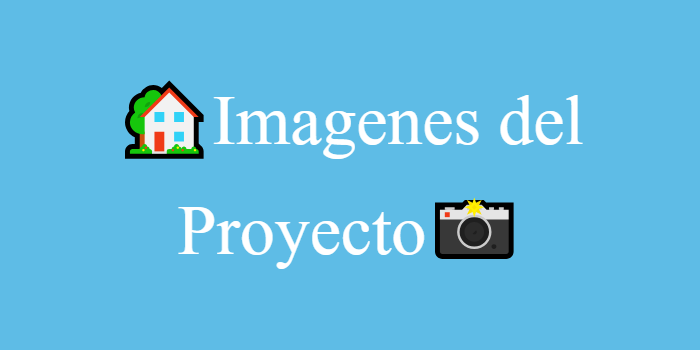
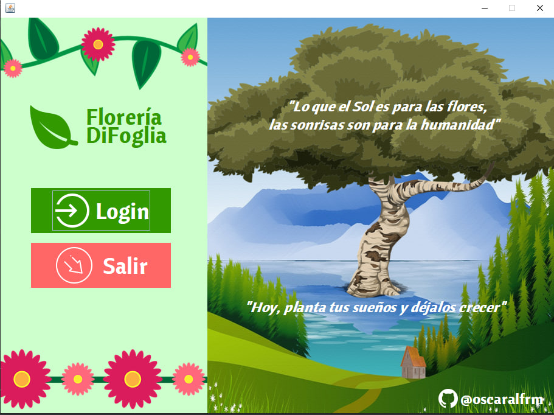
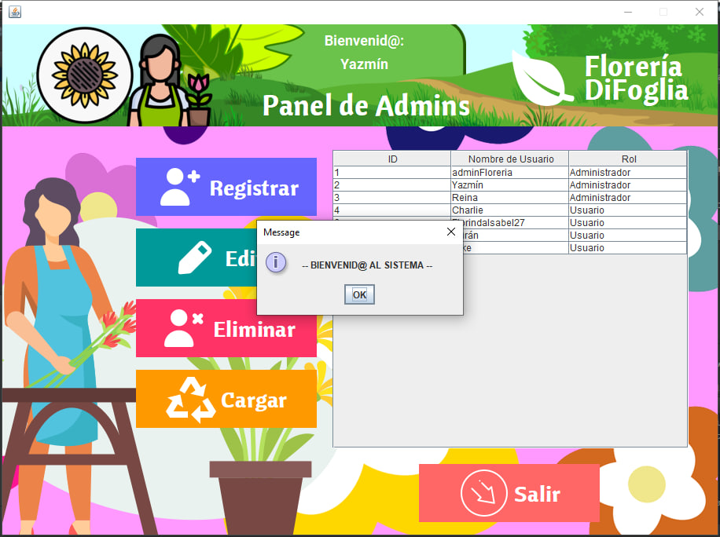
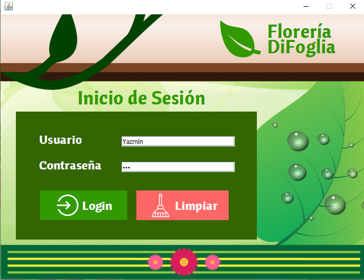
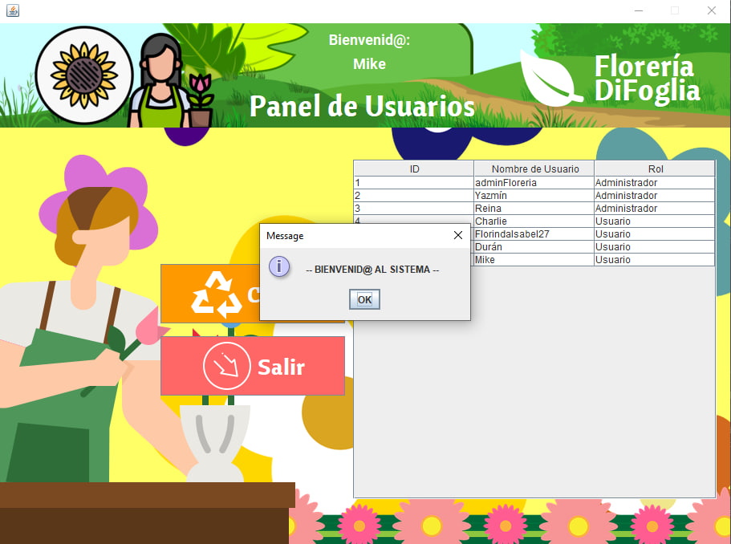
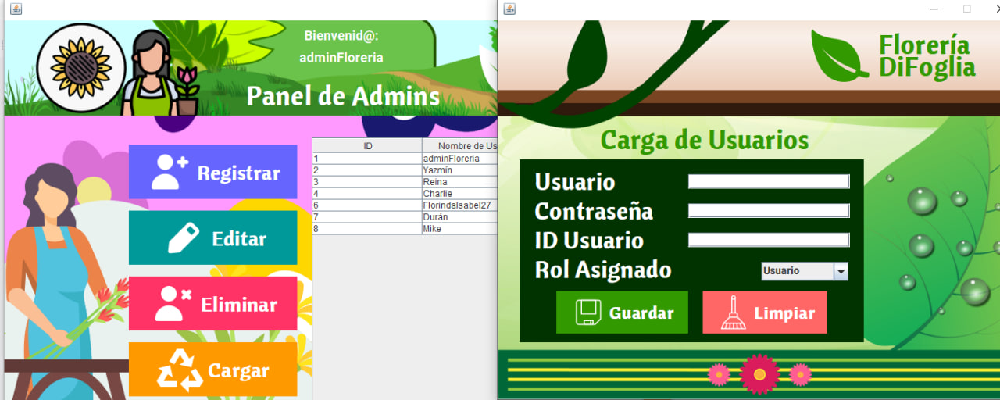
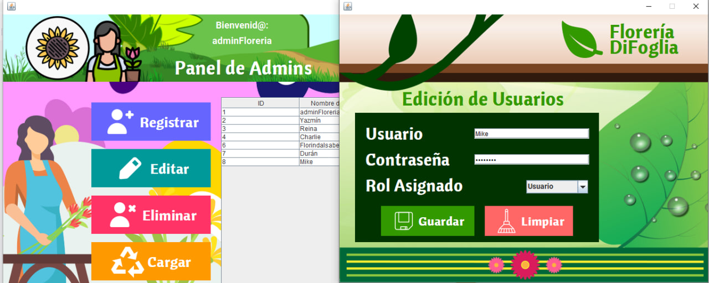
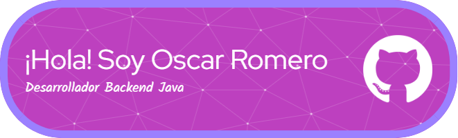

<section align="center">
  

Se presenta una aplicación de escritorio implementando la tecnología Java Swing, cuyo rol didáctico principal es el enseñar sobre los roles en un Sistema de Informacióny como poder gestionarlos,
  con el añadido de darle una temática de tienda de arreglos florales. Dicha app fue hecha como parte del curso "Programación Orientada a Objetos con Java" de la Academia TodoCode: https://todocodeacademy.com/course/programacion-orientada-a-objetos-con-java/

Se profundizaron sobre los siguientes ejes temáticos relacionados con el quéhacer de un POO en Java:

- <strong>CRUD (Altas-Bajas-Modificación-Consulta)</strong> sobre una Sistema Gestor de Roles, con temática de tienda de arreglos florales, se decidió trabajar sobre el requerimiento de la creación de una clase "Usuario" y una clase "Rol".
- <strong>Modelo de 3 capas (Interfaz Gráfica de Usuario o GUI, Lógica y Persistencia)</strong>. El usuario ingresa los datos a través de una interfaz gráfica (GUI, para ver su representación
terminada, leer el final del documento en donde se adjuntan capturas de pantalla del mismo) y los datos pasarán a través de una capa lógica para llegar, posteriormente, a ser almacenados
en una Base de Datos Relacional.
- <strong>Bases de Datos Relacionales</strong>: Con el Sistema Gestor de Bases de Datos MySQL, para la persistencia de los datos ingresados por el usuario.
- <strong>JPA</strong>: Java Persistence API, para el mappeo de las Entidades (Clases). Se utilizó el proveedor EclipseLink (en futuros proyectos se empleará el proveedor Hibernate). Cabe aclarar que en el presente proyecto, se trabajaron relaciones de tipo @OneToMany y @ManyToOne, proporcionadas por el gestor de JPA EclipseLink.

  

  

Dentro de las tecnologías implementadas en el marco del proyecto, se usaron:

  

  

  

En el siguiente trabajo, se pudo aprender y profundizar sobre conceptos relacionados al POO en Java, utilizando JPA como ORM que mappea relacionalmente las clases modeladas para persistirlas en la base de datos,
pudimos asociar ambas tablas a través de las annotations @OneToMany y @ManyToOne ; y practicar la lógica de programación. También se emplearon estractos programación funcional para resolver algunas validaciones asociadas con la edición de los usuarios,
integrando coherentemente diversos paradigmas de programación para concretar el desarrollo de la aplicación en cuestión.
  

  

A continuación, se mostrarán las pantallas creadas para soportar la capa de interfaz de la aplicación: 
  

  

  

</section>
